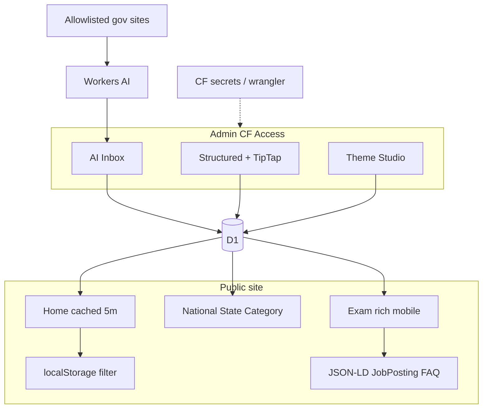

# ExamStatus CMS, Theme Studio, Hubs, i18n, Caching, and AI Drafts

## Locked product choice (confirmed)

**Option A:** Structured exam editor + content blocks (heading / paragraph / list / FAQ / CTA) + Theme Studio (colors, banner, fonts, footer, column labels) + roles — light Astro on Cloudflare Workers.

Not building a full Elementor-style drag-drop page builder.

**Stack endorsement (kept):** Astro + GitHub + Cloudflare Workers is the right architecture for Sarkari traffic spikes (edge, low cost, no SSH/PHP attack surface). Content updates will live in **D1 via admin**, so adding a job does **not** require a full GitHub rebuild.

## Competitor takeaways

- **Hubs:** Latest Jobs, Admit Cards, Results, Answer Keys, Syllabus, Admissions, Scholarships, **State**, **National**
- **Detail depth:** summary, dates, fees, age, eligibility, how-to-apply, selection, documents, FAQ, official links, related posts
- **Trust:** only `.gov.in` / `.nic.in` deep links; never claim to be government

Current gaps: Keystatic unwired; live data only [`src/data/exams.json`](src/data/exams.json); thin exam pages; weak mobile; no state/national hubs; no HI; filter not persisted; secrets process not formalized for cloud agents.

## Architecture (locked defaults)

| Concern | Choice | Why |
|---|---|---|
| CMS | Custom `/admin` on Astro + D1 | Fits CF + roles + AI drafts; no rebuild-per-post |
| Rendering | Keep **server** output on `@astrojs/cloudflare` + **edge Cache-Control** (~5 min) on home/hubs | Same outcome as “ISR every 5 min” without switching to static-only git content |
| Post body | TipTap blocks between fixed Sarkari sections | WordPress-like, light |
| Theme | `site_settings` CSS variables | Colors/fonts/banner/footer/labels |
| Auth + roles | Cloudflare Access + D1 roles | Hire-ready, secure |
| AI | Workers AI `@cf/meta/llama-3.1-8b-instruct-fast` | Free, CF-hosted |
| Publish | Approve by default; owner can set auto | Control |
| i18n | Stored EN + HI (Workers AI assist, human review) | SEO + privacy; not Google Translate widget |
| Hubs | `/national`, `/state`, `/state/[slug]`, `/category/[slug]` | Missing IA |
| Secrets | `.env` local + CF/Wrangler secrets only; never in `src/` | Safe for Cursor Cloud Agent + CF builds |

## Phase 0 — Secrets and deploy safety (prerequisite)

Before any Cursor Cloud Agent build or sharing the repo more widely:

- Audit repo: no API tokens, webhook URLs, DB passwords, or Access secrets in `src/`, commits, or plan docs
- Local: `.env` / `.dev.vars` for Wrangler; keep [`.gitignore`](.gitignore) covering `.env`, `.dev.vars`, `.wrangler/`
- Production: Cloudflare Dashboard **Secrets** / `wrangler secret put` for anything sensitive; D1 binding already in [`wrangler.toml`](wrangler.toml) by id (ok) — never put account API tokens in git
- Document: “Cloud Agent may run only after secrets audit passes”

Traditional server threats (SSH, PHP) already avoided by Workers edge; Cloudflare DDoS absorption stays as-is.

## Caching vs rebuilds (technical clarification)

The external review suggested Astro `hybrid` + ISR so new jobs do not wait on a 2‑minute GitHub build.

**Our plan (better fit for CMS-on-D1):**

- Keep `output: 'server'` (current) so admin publishes write to D1 and public pages read D1 immediately
- Add **Cache-Control / Cloudflare Cache API** on high-traffic list pages (home, national, state hubs): `s-maxage=300` (5 minutes) or purge on publish
- Exam detail pages: shorter cache or `stale-while-revalidate` so spikes stay cheap
- GitHub/Cloudflare builds remain for **code/theme deploys**, not for every content edit

Optional later: prerender truly static marketing pages (`about`, `privacy`) with `prerender = true` inside the same server project (hybrid-style per-route), without moving content back into the git tree.

## Anti-thin-content exam page (required)

Section order on every published post:

1. Title + breadcrumbs + tags (qualification, sector, level, state)
2. Unique **summary** (2–4 sentences; paraphrased — not competitor copy-paste)
3. **DataSheet** (dates, fees, age, eligibility)
4. **How to apply**
5. **Selection process**
6. **Documents required**
7. TipTap additional blocks
8. **FAQ** (≥3)
9. CTA links (apply / PDF / official / result)
10. Disclaimer + **related posts** (category, eligibility, state, board — shareable deep links)

Publish gate: summary, FAQ ≥3, allowlisted official host required.

### Example

SSC CGL 2026: original summary + datasheet + OTR steps + Tier stages + document checklist + fee/last-date FAQs + related SSC/Graduate posts.

## Mobile / responsive

- Sticky mobile CTA: Apply | PDF | Official
- Tables: horizontal scroll + optional card layout on small screens
- Touch targets ≥ 44px; filter chips wrap cleanly
- Theme Studio mobile + desktop preview

## National / State / category hubs

| Route | Purpose |
|---|---|
| `/national` | Central boards (SSC, UPSC, IBPS, RRB, NTA, Defence…) |
| `/state` | All states/UTs with counts |
| `/state/[slug]` | e.g. `/state/uttar-pradesh` |
| `/category/[slug]` | jobs / admit / results / answer-keys / syllabus / admissions / scholarships |

Each hub: unique H1 intro (anti-thin SEO) + filtered lists + internal links.

## Smart Eligibility Filter (localStorage)

On [`src/pages/index.astro`](src/pages/index.astro) (and hubs that reuse filters):

- On qualification click, persist `examstatus_qual` (and later `examstatus_state`) in `localStorage`
- On load, restore selection and apply filter automatically
- Provide clear “Reset filters” control
- Optional later: sync preference into Web Push topics

## Structured data (SEO / Google Jobs)

Build reusable Astro components (exam already starts JobPosting — harden and extend):

- **JobPosting** — title, description, datePosted, validThrough, hiringOrganization, educationRequirements, totalJobOpenings, directApply, sameAs official URL
- **FAQPage** — from post FAQ array
- **BreadcrumbList** — Home → Category/State → Post
- Only emit JobPosting when `category` is job-like and dates are valid; skip or switch type for pure result/admit pages if needed (use `Article` / `WebPage` where JobPosting is inappropriate)

## Language / regional traffic

- Stored `title_hi`, `summary_hi`, translated sections in D1
- Path or query + cookie toggle; Theme Studio bilingual chrome
- Admin “Generate Hindi” via Workers AI → human review
- **No** sitewide Google Translate widget (weak SEO, noisier privacy)
- Expand to BN/TA/TE/MR later per top states only

## Legal and brand

- Keep **ExamStatus / ExamStatus.in** naming (generic, searchable)
- Editor + AI prompts: **paraphrase** summaries and how-to text; never scrape/copy competitor aggregator wording (DMCA risk)
- Always attribute facts to official notification; disclaimer already in footer
- Style guide in admin: ban “guaranteed selection”, require official-link disclosure

## Content model (D1)

- **posts** — Sarkari fields + `level`, `states[]`, summaries, how-to-apply, selection, documents, faq, body_blocks, URLs, SEO, `last_verified_at`, `source_url`, status, timestamps
- **site_settings** — theme, nav, bilingual chrome, `ai_mode`, allowlist, cache TTLs
- **ai_drafts**, **admin_users**
- Keep feedback / analytics / push_subscribers

## Admin UI

Behind Cloudflare Access: Dashboard, Posts, Theme Studio, AI Inbox, Team. Roles: `owner` | `editor` | `researcher`.

## AI research Worker

Allowlisted official domains only; Llama → schema JSON with original phrasing; approve/auto; audit log. No competitor scraping.

## Security (ongoing)

- Access on `/admin`; role lookup by email in D1; CSRF; rate limits
- No aspirant PII in AI logs
- Secrets only via CF / `.env` (Phase 0)

## Implementation phases

### Phase 0 — Secrets hygiene
Audit + `.env` pattern + document cloud-build readiness

### Phase 1 — Rich posts + mobile + D1 + cache
Migrations, seed, D1-backed pages, mandatory sections, sticky CTAs, Cache-Control on hubs

### Phase 1b — Hubs + i18n
National/state/category routes; EN/HI stored + Generate Hindi

### Phase 1c — UX + SEO schema
localStorage filter; JobPosting/FAQ/Breadcrumb components; related-link rules

### Phase 2 — Secure admin CMS
Access, TipTap, roles, publish validation, paraphrase style guide

### Phase 3 — Theme Studio
CSS variables in [`ExamLayout.astro`](src/layouts/ExamLayout.astro)

### Phase 4 — AI draft pipeline
Cron + Inbox + approve/auto + original-phrasing prompts

### Phase 5 — Polish
Sitemap, extra hubs, Access hire docs, Web Push later

## Out of scope

- Full Elementor builder
- Paid AI APIs / custom fine-tunes
- Scraping Sarkari aggregators
- Unreviewed machine-translate of every page
- 10+ languages on day one
- Pure `output: 'static'` with content-only in git (conflicts with CMS-on-D1)

## Plugins / tooling

- **Keep:** Cloudflare Bindings / Builds / Observability
- **Add:** Cloudflare Access; Workers AI binding; Wrangler secrets workflow
- **Not required:** Supabase; Google Translate widget; heavy CMS SaaS

---

## Follow-up suggestions (with examples)

### SEO and trust
- Unique 150–300 word summary — “SSC CGL 2026 opened for 14,582 posts…”
- FAQ JSON-LD — fee / last date / admit card
- Last verified stamp — “Checked vs PDF 26 Aug 2026”
- Official-link 404 checker in admin

### Navigation
- `/qualification/graduate`, `/board/ssc`
- Exam calendar by month
- Shortlist/compare via localStorage

### Engagement
- Web Push by state/category
- Telegram/WhatsApp links per state in Theme Studio
- “What changed” on updates

### Ops
- Category templates (Admit Card FAQ stubs)
- Duplicate-title warnings
- Researcher must attach `source_url`

### Regional
- After HI: BN/TA for top states
- State PSC allowlists (`uppsc.up.nic.in`, …)

### Quality bar
Publish only when: unique summary, dates, official URL, eligibility/vacancy, how-to ≥3 steps, FAQ ≥3, mobile sticky Apply, ≥2 related links, EN complete (HI encouraged).
